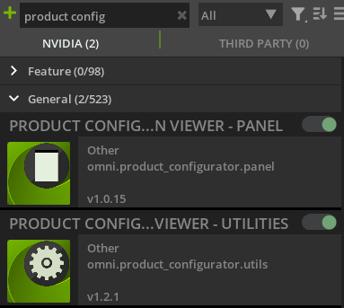
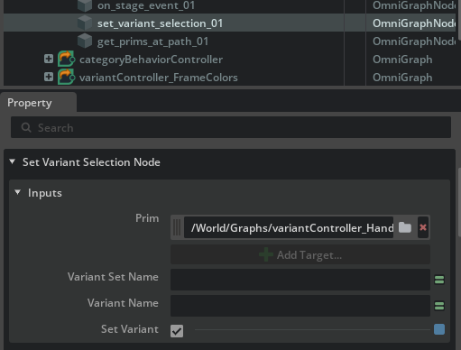
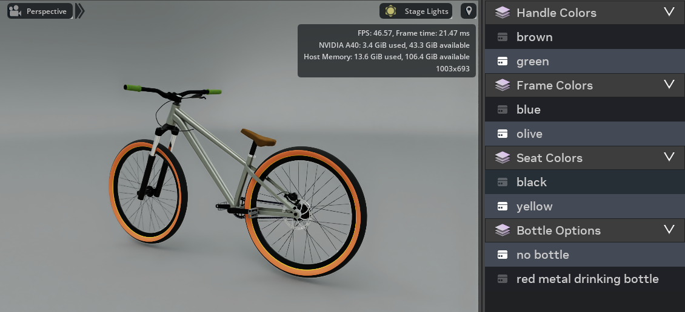

# Product Configurators

In this chapter we are going to explain and show how the configurator works based on an example. We are going to use the bicycle from the previous chapter together with the product configurator. 

1. **/src/cycle_demo/assets/products/product_P3_basicbike/product_P3_basicbike.usd**

First a step by step guide on how to set up the product configurator:

1. Enable the product configurator extension in Nvidia Omniverse

2. Inside the repository are the following requirements so that the extension works:
    - **/src/cycle_demo/assets/configurators/Assets**: In this folder is a camera and the background asset stored for the scene.
    - **/src/cycle_demo/assets/configurators/DataStructure**: There are the prims for the data structure and the ActionGraph usd-files stored to make the product configurator work

3. Open the empty_configurator.usd  you can find in your Data Structure Folder in Omniverse Usd-Composer. As you can see there is already a stage with the referenced Assets and placeholders where additional data will be stored. For example the Configurable_Assets Scope which we are going to fill in the next step. Save it inside the **/src/cycle_demo/assets/configurators** folder and name it my_first_configurator.usd 

4. Add a reference of your product you would like to configure under the Configurable_Assets Scope Folder
    - Navigate to **products/product_P3_basicbike** and drag the **product_P3_basicbike.usd** on the Configurable_Assets Scope. (Configuarble_Assets is parent of product_P3_basicbike)
    - You should see the bike in your Scene

5. In Tools/Product Configurator/Utilities select "Create DataStructure"
    - The first input field needs the path to the DataStructure/Prims folder.
    - The second input field needs the path to the DataStructure/Graphs folder.
    - Click on "Create Data Structure" and the necessary files and action graphs for the extension to work will be generated

6.  Now we need to enable the actual change between different variations in our product:
    - In the Stage window find the Graphs Scope Folder
    - Search for every Graph which starts with "variantController"
    - Unfold it and search for the set_variant_selection_01 prim
    - In the property window --> mark "Set Variant" as true

7. Open the Configurator Panel with Tools/Product Configurator/Panel
    - Now you can switch between the different variants of your bicycle 

8. If you wish you can have a look at our prepared configurators: configurator_P3_basicbike or configurator_P2_unicycle
    - **/src/cycle_demo/assets/configurators/configurator_P3_basicbike.usd**

That is all it takes to make the configurator work.