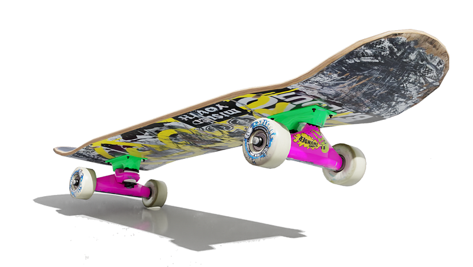
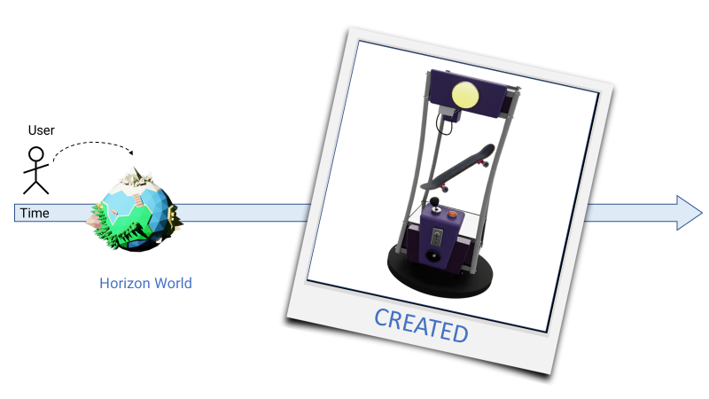
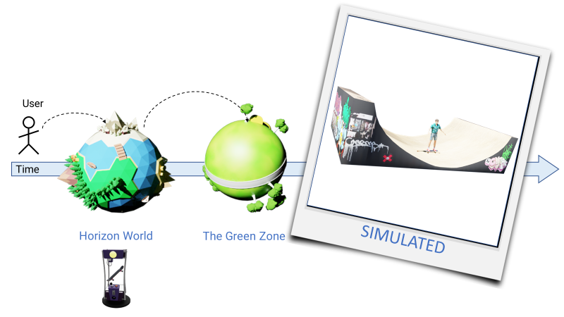
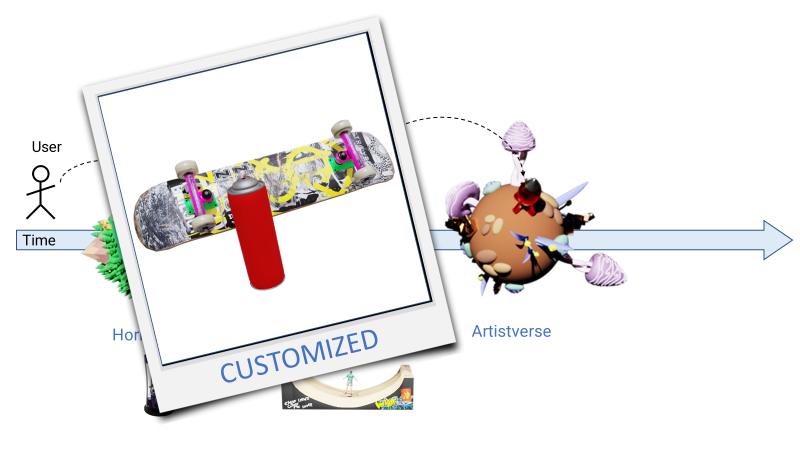
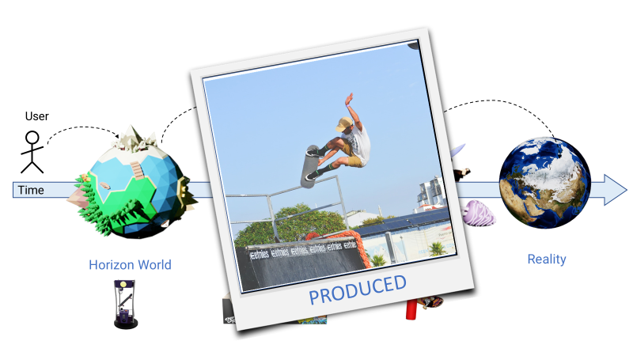
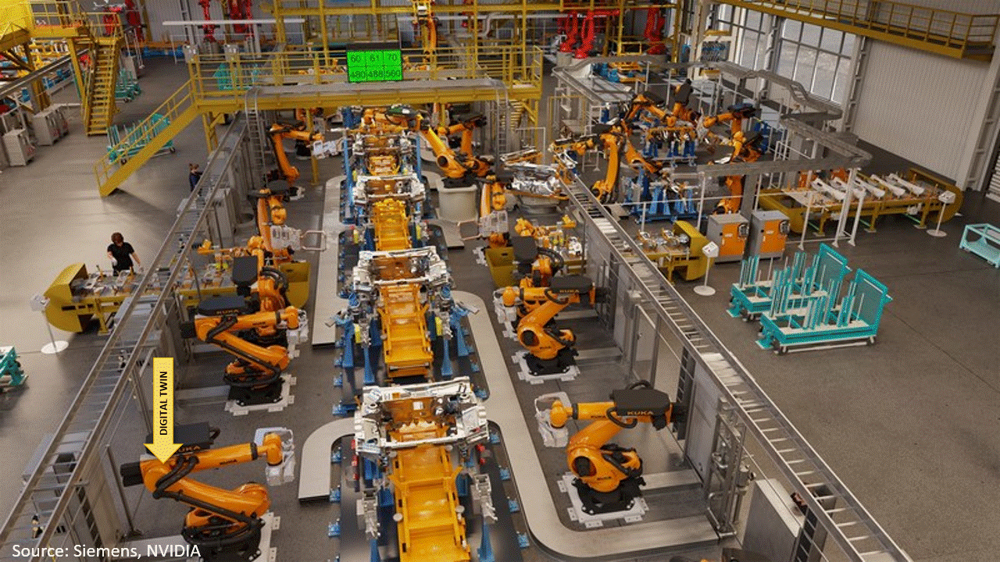
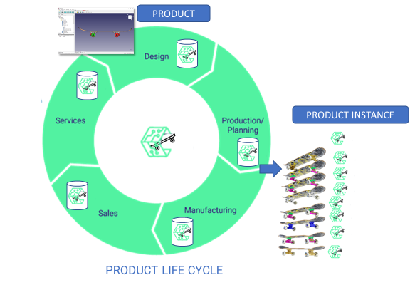
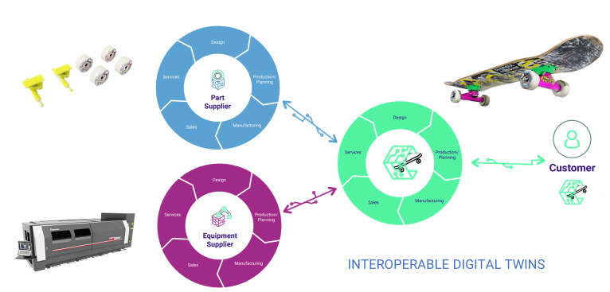
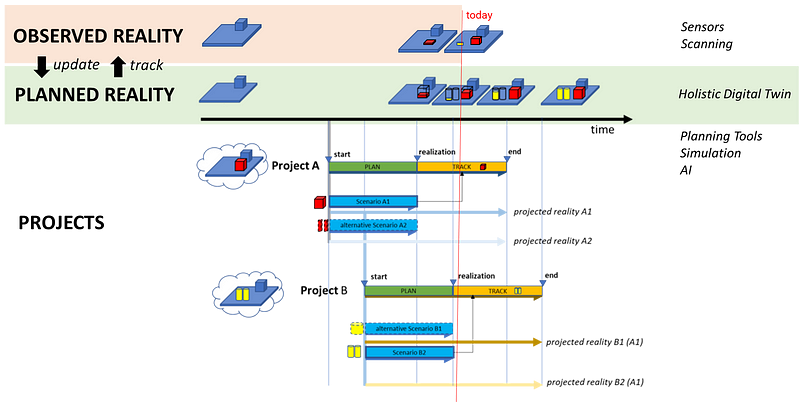

# The Industrial Metaverse

## Definitions of the Metaverse

In his book "The Metaverse," Matthew Ball delineates what I'd term the Social Metaverse as:
> "A massively scaled and interoperable network of real-time rendered 3D virtual worlds that can be experienced synchronously and persistently by an effectively unlimited number of users with an individual sense of presence, and with continuity of data, such as identity, history, entitlements, objects, communications, and payments."

For the Industrial Metaverse, we propose the following definition:
> "A global scale network of enterprises utilizing interoperable digital twins of products and processes across the product life cycle and throughout value chains to design, simulate, and produce perfect products without waste."

To elucidate how both facets of the Metaverse are related and to understand concepts like interoperable assets and continuity of data, let’s delve into a simple example—a skateboard.

## The Skateboard Example

|  |
|:--:|
|  *The skateboard* |

### Create

Imagine you are a Metaverse user who decides to visit one of the many connected virtual worlds as described by Matthew Ball, say "Horizon World."

|  |
|:--:|
|  *User visits "Horizon World" and creates a virtual skateboard* |

While exploring, you stumble upon an asset store of your favorite skateboard manufacturer, "Skateboards Inc." There, you discover a skateboard configurator booth that empowers you to design the skateboard of your dreams. After tailoring the model to your liking, a click on the configurator materializes the virtual asset and transfers it to your inventory.

### Simulate

As the proud owner of your virtual skateboard, you venture to another virtual world named "The Green Zone," home to a plethora of virtual outdoor activities.

|  |
|:--:|
|  *Engage in virtual half-pipe stunts showcasing your brand new virtual skateboard* |

This scenario underscores the continuity of data and interoperability of assets—you can utilize the skateboard asset, conceived in the previous world, in the simulation of the halfpipe in the current world. Therefore, the virtual asset must possess standardized geometric and physical properties while providing semantic information to enable its integration into the simulation.

### Customize

Next, you journey to another world, dubbed "Artistverse," a haven for artists.

|  |
|:--:|
|  *The skateboard gets customized in "Artistverse"* |

Here, you could solicit your favorite graffiti artist to create a bespoke artwork for the deck. One artist might employ Adobe Substance 3D Painter to modify the texture on your skateboard's plank, while another might use Blender. This necessitates standardized asset properties to facilitate modification by different software tools, with these modifications being persistent across virtual worlds.

### Produce

Suppose you transition back to the real world, swapping your virtual reality headset for augmented reality glasses. The fun you had with your virtual skateboard spurs you to acquire a real one, resembling the virtual model.

|  |
|:--:|
|  *Select and order the real product from "Skateboards Inc."* |

A few days later, the real product, adorned with your custom artwork, arrives. A digital product key on it links to its virtual counterpart, enabling anyone with AR glasses to scan the key and acquire either the virtual asset or the real product from "Skateboards Inc."—the possibilities are boundless.

## Digital Twins

The digital twin is a digital asset tethered to a real-world product. Now, we transition from the Social Metaverse to the Industrial Metaverse, having created a real product linked to a digital asset.

|  |
|:--:|
|  *Digital twins in the Industrial Metaverse* |

The Industrial Metaverse is built on digital twins.

## Digital Factory

Recalling the scene from the video from Nvidia and Siemens, the depicted production environment is a digital twin of the real manufacturing setup, comprising numerous interconnected digital twins of real-world assets like robots, fixtures, and even human workers.

### Digital Twins along the Product Life Cycle

|  |
|:--:|
|  *Digital twins products and instances* |

Your team at "Skateboards Inc." navigates through various stages, from design to sales, engineering, production planning, and manufacturing, each enriching the digital product twin to facilitate communication, collaboration, and optimization.

### Digital Twins across Value Chains

|  |
|:--:|
|  *Digital twins ecosystem* |

Interoperable digital twins not only thrive along their product life cycle but also across value chains encompassing multiple organizations. This unlocks potential in all workflows and operational activities, leading to more sustainable processes across entire value chains.

## Observed & Planned Reality, Projects & Scenarios 

|  |
|:--:|
|  *Reality Layers* |

The Industrial Metaverse introduces an additional layer of reality, encapsulating both historic and future states of all digital twins it contains, which I term as the "Planned Reality" layer. This layer may be updated from the real-time layer, dubbed "Observed Reality."

## Conclusion

Both Social and Industrial Metaverse share common elements of data continuity and interoperable digital assets. However, while the Social Metaverse indulges individual users in a synchronous real-time experience, the Industrial Metaverse empowers organizations to strive for sustainable products and processes by leveraging holistic digital twins across the product life cycle and throughout value chains.
