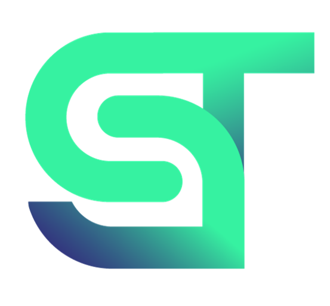

# Introduction

- What is the Industrial Metaverse 
- The role of OpenUSD in the Industrial Metaverse.
- The importance of templating and standardizing assets.
- Workflows and the Digital Twin Operator 
- The SyncTwin Omniverse App 

 
