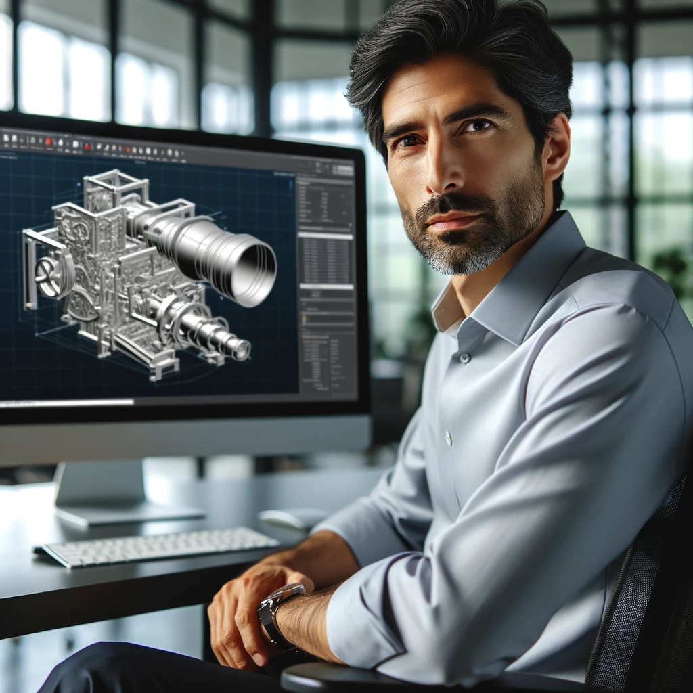
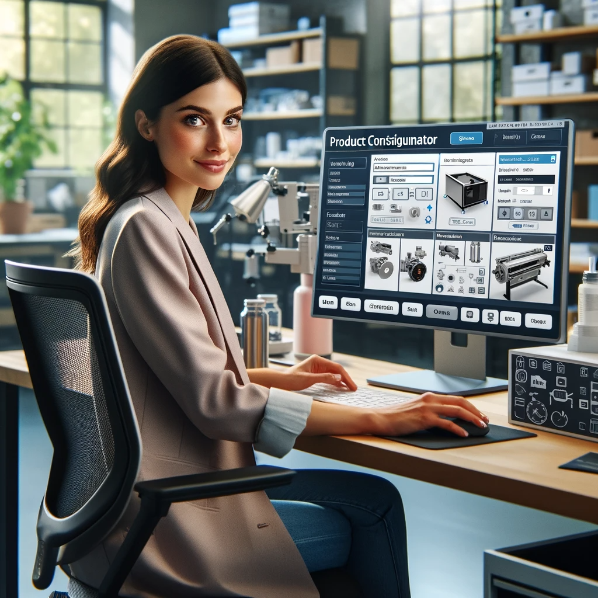
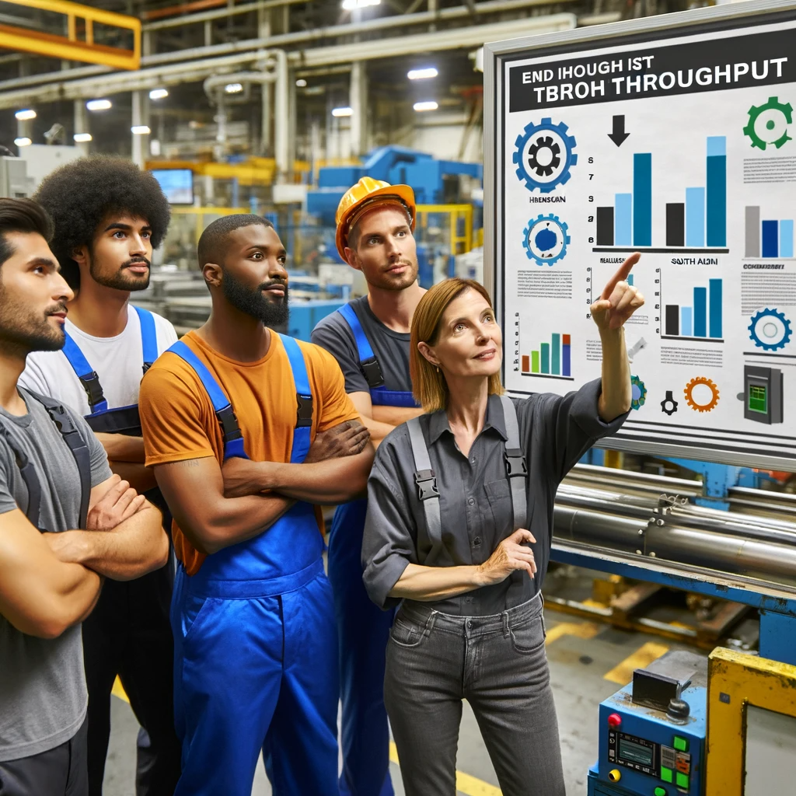
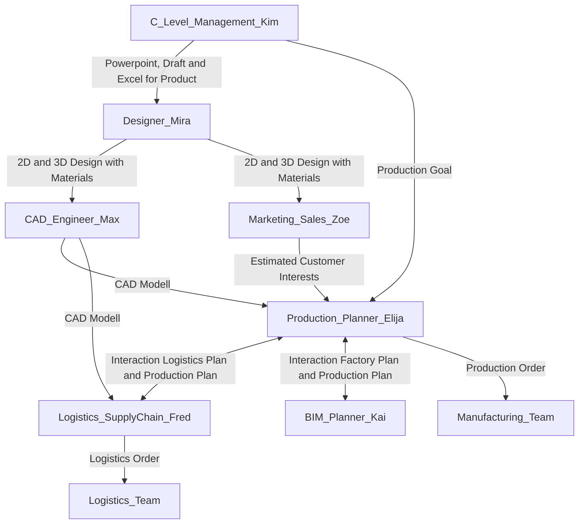

# TwinOps - Digital Twin Operations

## Digital Twin Operations

Digital Twin Operations (TwinOps): The systematic process of creating, managing, synchronizing, and refining digital twins—virtual replicas of physical assets or processes—to mirror real-world conditions and behaviors. TwinOps involves harnessing data-driven insights from these digital representations to optimize performance, predict failures, and support decision-making in real-time industrial and business environments.

## TwinOps Engineer and other roles 

| Persona | Role | Description |
|:----:|:--------|:------------|
|| **Alex**   *Twin Ops Engineer* | Alex is a TwinOps Engineer who expertly maintains the factory's digital twin, building reliable data pipelines based on OpenUSD and using an array of tools, with the SyncTwin Omniverse App being a vital component in her toolkit.|
|| **Kim and C-Level Team**   *Management* | Kim and the C-Level management team utilize the digital twin model to make data-driven decisions, enhancing operational efficiency and predicting future challenges. This cutting-edge approach allows them to visualize the entire company's workflow, optimize performance, and strategically plan for long-term growth.|
|| **Max**   *Product Development*  |  Max from Product Development provides the product CAD designs using CAD tools like Onshape. The CAD models are transferred in this case with the Omniverse Onshape connector. Alex makes sure that the unified bill of materials is matched with the product features.  |
|| **Zoe**   *Sales & Marketing*  | Zoe from Marketing is creating the product configurator used in sales pitches and on the web. She uses the Omniverse product configurator template with the CAD data provided by Max. |
|| **Elijah**   *Production Planning*  | As a Production Planner, Elijah optimizes manufacturing workflows and ensures resource availability, aligning production schedules with demand forecasts. He closely monitors quality and efficiency metrics to maintain seamless operations and meet delivery targets. |
|| **Fred**   *Logistics & Supply Chain*  |  Fred from logistics planning has to plan the inner factory material flow as well and the supply chain for inbound logistics. |
||  **Manufacturing Team**  | The production team efficiently executes Elijah's plans, utilizing monitor apps that source data from digital twin components to track progress and ensure adherence to the precise timelines and quality standards of the manufacturing process. |
||  **Logistics Team**  | The logistics team executes Fred's detailed plans, using applications synced with digital twin models to track and adjust their activities. This ensures efficient material handling and precise coordination with production timelines, aligning seamlessly with broader company objectives. |
||  **Mira**  | The design team creates the product design based on the specification of the C-Level Management. After creating an approved design the CAD expert and the Marketing Team are using it to do their work. |
||  **Kai**  | The BIM planner is responsible for the structure of the factory hall. The factory plan is than send to the production planner and the logistic planner so they have knowledge on where they possibly can produce what. |

