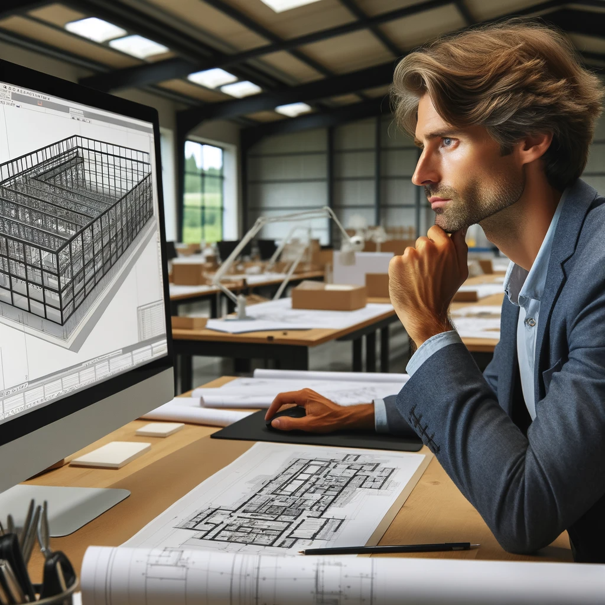
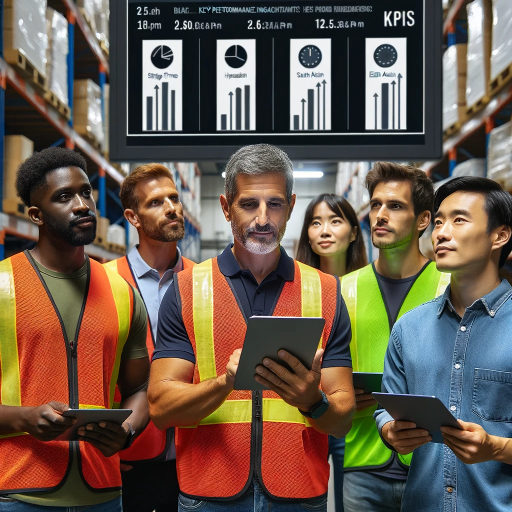

# TwinOps - Digital Twin Operations

## Digital Twin Operations

Digital Twin Operations (TwinOps): The systematic process of creating, managing, synchronizing, and refining digital twins—virtual replicas of physical assets or processes—to mirror real-world conditions and behaviors. TwinOps involves harnessing data-driven insights from these digital representations to optimize performance, predict failures, and support decision-making in real-time industrial and business environments.

## TwinOps Engineer and other roles 

| Persona | Role | Description |
|:----:|:--------|:------------|
|| **Alex**   *Twin Ops Engineer* | Alex is a TwinOps Engineer who expertly maintains the factory's digital twin, building reliable data pipelines based on OpenUSD and using an array of tools, with the SyncTwin Omniverse App being a vital component in her toolkit.|
|| **Kim Management Team**   *Management* | Kim and the C-Level management team utilize the digital twin model to make data-driven decisions, enhancing operational efficiency and predicting future challenges. This cutting-edge approach allows them to visualize the entire company's workflow, optimize performance, and strategically plan for long-term growth.|
||  **Mira**   *Product Design* | Mira crafts the initial product concepts, meticulously aligning with the strategic vision and specifications set forth by C-Level Management. Once a design receives approval, it serves as a vital blueprint for the CAD specialists and the Marketing Team to execute their respective roles, from detailed modeling to market positioning. |
||  **Kai**   *BIM Planning* | Kai orchestrates the layout of the factory hall, ensuring a strategic design that optimizes space for manufacturing and logistics. This detailed plan is then relayed to production and logistics planners, providing them with a clear blueprint of the available spaces and potential production zones within the facility. |
|| **Max**   *Product Development*  |  Max from Product Development provides the product CAD designs using CAD tools like Onshape. The CAD models are transferred in this case with the Omniverse Onshape connector. Alex makes sure that the unified bill of materials is matched with the product features.  |
|| **Zoe**   *Marketing*  | Zoe from Marketing develops strategies to promote products, crafts compelling narratives to engage potential customers, and analyzes market data to guide her company's advertising efforts. She uses Mira's designs in her communication as well. |
|| **Greg**   *Sales*  | Greg from Sales is responsible for driving the commercial success of his company's products. His forecasts help Eli and Fred to plan production and logistics. He uses product configurators in sales pitches and on the web. |
|| **Eli**   *Production Planning*  | As a Production Planner, Eli optimizes manufacturing workflows and ensures resource availability, aligning production schedules with demand forecasts. He closely monitors quality and efficiency metrics to maintain seamless operations and meet delivery targets. |
|| **Fred**   *Logistics & Supply Chain*  | Fred, the logistics planner, is pivotal in streamlining the internal material flow and coordinating the inbound supply chain, and he also strategizes the outbound logistics to ensure the finished products are delivered to customers efficiently and reliably. |
||  **Manufacturing Team**  | The production team efficiently executes Eli's plans, utilizing monitor apps that source data from digital twin components to track progress and ensure adherence to the precise timelines and quality standards of the manufacturing process. |
||  **Logistics Team**  | The logistics team executes Fred's detailed plans, using applications synced with digital twin models to track and adjust their activities. This ensures efficient material handling and precise coordination with production timelines, aligning seamlessly with broader company objectives. |

